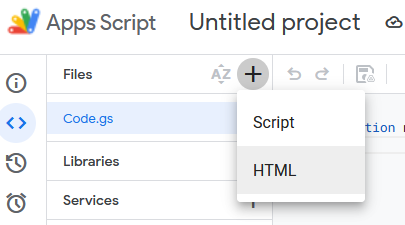
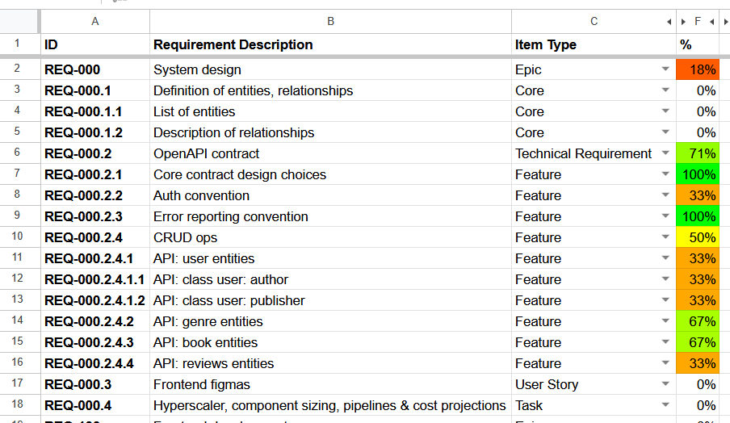

# Google Sheets - Project Tracker

This Google Sheets Apps Script helps your team track the entire project lifecycle and manage checklists for individual tasks.

## Features

- **Requirements Management**: Track requirements with hierarchical IDs, descriptions, types, and priorities
- **Cross-Cutting Concerns**: Manage aspects that affect multiple requirements (security aspects, API variants, etc)
- **Flexible concerns application**: Allow injection of cross-cutting concerns freely without constraints, across individual requirements or any group of requirement via a dedicated Concerns Picker UI
- **Automatic Checklist Generation**: Create comprehensive checklists combining requirements and concerns
- **Team Assignment**: Assign tasks to team members from a configurable team roster
- **Task Status Workflow**: Track items through design, development, testing, and shipping phases
- **Hierarchical Structure**: Automatically propagate concerns from parent to child requirements
- **Completion Calculation**: Automatically calculate and update completion percentages
- **Visual Progress Tracking**: Color-coded completion percentages show project progress at a glance
- **State Persistence**: Maintain assignment and completion status  when regenerating checklists
- **Data Validation**: Enforce consistent data entry with dropdown menus and checkboxes

## Install

1. Start a fresh Sheets document
2. `Extensions` → `Apps Script`
3. In the code IDE which opens, there should be a nearly empty `Code.gs` source file object visible in the selector in the left side:

4. Overwrite this file with the entire content of this repository's `Code.gs`
5. Make sure to save the file's new contents with the *Save* icon:
   

6. Create a new HTML file by clicking `+` on the `Files` section, then selecting `HTML`:
   
7. Name this file `ConcernPicker` (the .html extension is implicitly added):

   

8. Overwrite this new file wih the entire content of this repository's `ConcernPicker.html`
9. Save this file too.
10. **You're done.** Close the IDE tab, go back to the sheet document, give it a meaningful name and reload it. 

# How to use

## Fair warning

This Sheets app consists of server-side code which run on Google's cloud infrastructure on your behalf. Google may initially request you to explicitly grant code execution permissions for your user. This usually happens once.

## Schema setup

Once loaded, the app adds the `Requirements Tracker` menù entry to your Sheets document. To start using the tracking features, select 
   `Requirements Tracker` → `Setup Sheets`

The script will take some seconds to run. Upon completion, you should be greeted with a confirmation message.

There will also be three new sheets added to the document:

- **Requiremens**: will list the project's itemized requirement list
- **Cross-Cutting Concerns**: will list the *concern aspects* which may be individually be applied to each of the requirement
- **Main Checklist**: will be auto-populated and will contain an itemized list of assignable, trackable work units

## Listing requirements

Every Project Management methodology that aims to—at the very least—avoid driving people insane makes some attempt to break down complex projects into sub-problems or requirements. These can each be further decomposed into sub-requirements, and so on. There's no explicit limit to how deep this itemization can go but let's assume the threshold is reached when the sub-requirements start to look a lot like a one-man/one-session tasks.

Each requirement must have an ID which adopts a hierarchical naming convention using dots for level separation.

Example:

These are the main, higher-level requirements in this project, and usually take the name of `Epic`s. Go ahead and pick your own entries.

Requirement IDs *MUST have* a prefix, any prefix and not necessarily `REQ-xxx` (see [Configuration](#configuration)), but at least pick a short, sensible one.

Now let's decompose in sub-requirements `REQ-000` (System design). Top of mind:

Note the `.<n>` part of the requirement id which adds a underlying level to the main requirement, `REQ-000` in this case.

Now keep going until the project is decomposed in basic requirements which are entirely addressable in simple, bite-sized tasks:

## Using cross-cutting concerns

In Project Management a *"cross-cutting concern"* is an aspect, remark, or feature that affects multiple parts of the project or system, spanning across different requirements. 
These are said to be *cross-cutting* because they don't fit neatly into a single requirement but rather intersect with many. Granting them their own cardinality allows us to apply them arbitrarily across the requirement bill.

Listing cross-cutting concerns is done in the `Cross-Cutting Concerns` sheet. An example of aspects you've probably dealt with before:

As defined above, these sound a lot like technical requirements, but don't fit in a single spot in the requirement hierarchy. However they intersect a lot of others.

### Using the Concern Picker dialog

Each entry in the `Requirements` sheet can have its own set of cross-cutting concerns assigned to it, regardless of the nearby requirements. You can apply CCCs individually, to a range or a multiple selection of requirements using the `Concern Picker` feature.

Here's how to proceed:

1. In the `Requirements` sheet, select the requirement row (or rows) you want to change the CCC assignments for. Range-select and multi-select will work here. A single selected cell in a populated requirement row will count as a selection of that requirement.

2. `Requirements Tracker` → `Concern Picker`:

3. In the the `Select Cross-Cutting Concerns` dialog which opens, check the concerns to be applies to the selected requirement entries, then click `Apply`

4. The CCCs are now applied to the selected requirements. The Picker allow to ristribute and remove CCCs individually across any selection of requirements while preserving the others. Example:

In the example above, the Concern Picker preserves the existing distribution of `CCC-01` across the selected requirement range (red arrow). When `CCC-01` is left in the indeterminate state (`[-]`), it remains unaffected. However, like any other requirement, it can still be toggled—as shown with `CCC-03` (green arrow)—to be either set or removed across the entire requirement selection.

### Manual CCC editing

CCC assignments can be edited manually. Not allowing this would be guarantee of having enraged managers. To do this, CCC assignments can be accessed as a regular sheet column which is normally hidden:

The `Concerns` column is revealed, listing all per-requirement CCCs assignment matrix. These cells can be edited manually. CCC ids are normally listed separated by comma, but a whitespace will work too:

## Tracking progress

In order to track the project progress it is necessary to generate the contents of the `Main Checklist` sheet. This has to be done every time the requirements, CCCs, or their assignment change.

1. Select `Requirements Tracker` → `(Re)Generate Checklist`:

2. The effect of this step is to populate the `Main Checklist` sheet with trackable items, units of work:

Each checklist item consists of:
- Unique ID
- Requirement the item satisfies (ID, type and description)
- Any indication about a parent requirement, if existing, to provide additional context
- Cross-cutting concern which merges with the base requirement, if any (ID and description)
- Assignee of the item
- Work status
- A checkable flag if any associated test pass (can be used for human checklist evaluation too)

Each checklist item should correspond to at least a single aspect relevant to an unit of work. The aggregation of all items gives life to a checklist that, if observer (and possibly verified by a third party) provides at least a partial insurance policy against forgetting about aspects of the project, its implementation, features, functions or security aspects.

Team members can be give access to this view. It is meant to be shared so that individual members can be assigned work contexts in the project and report on it.

That is, after all, the whole point of having a Project Management policy in place.

### Assign team member names

If you intend to use the `Assigned to` status column, now would be the time to set the team member names (see [Configuration](#configuration)), so that the correct names show up in the column. Remember to regenerate the checklist afterwards.

### Refresh the checklist often!

Item assignments and their status aren't lost when the `Main Checklist` is regenerated to reflect a change in requirements. Feel free to refresh.

### Overall completion tracking

A work item is considered ***done*** when:

- its `Status` cell is set to `Shipped` or `Rejected`
- _or_ its `Test OK` flag is _checked_

All ***done*** items are accounted in the requirement percentage completion stats column, which normally updates in near-real-time when the item status change, however an overall refresh can also be triggered by hand:

# Configuration

!The `Config` sheet is normally hidden. It hosts project-wide configuration options. It can be accessed by revealing it via `View` → `Hidden sheets` → `Show Config`:

## Team member names

- **Key name**: `Project Team`
- **Format**: list of strings (JSON)
- **Content**: list of team members in team
- **Function**: shows up in the `Main Checklist` sheet, `Assigned to` column
- **When to change**: Should be clear.

## Discardable prefixes

- **Key name**: `Discardable Prefixes`
- **Format**: list of strings (JSON)
- **Content**: prefixes to be left-side-trimmed by requirement and CCC IDs
- **Function**: enables tidy creation of checklist item IDs in the `Main Checklist`
- **When to change**: In case the ID naming convention for requirements or CCCs causes very long, unkempt check list item ID generation.

